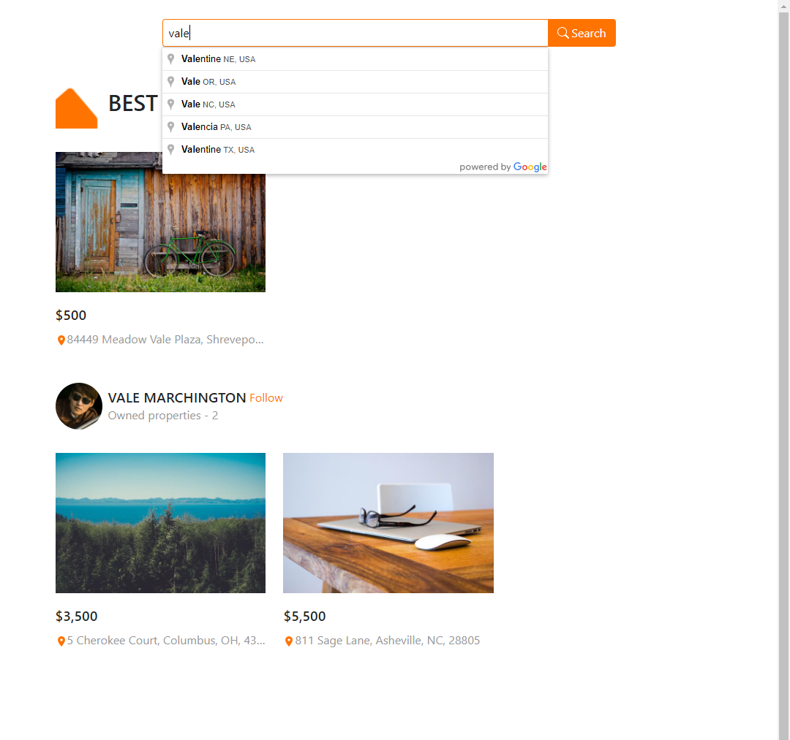

# Property Lookup App

This project was bootstrapped with [Create React App (CRA)](https://github.com/facebook/create-react-app) for the frontend and with `express-generator` for the backend.

[Live view](https://property-lookup.herokuapp.com/)

**Note:** Heroku will turn off the app after 30 mins of inactivity. You may get an initial error message of `Cannot GET /` at first load. Just reload the page.

## Table of Contents

- [Overview](#overview)
  - [The challenge](#the-challenge)
  - [Screenshot](#screenshot)
- [My process](#my-process)
  - [Backend](#backend)
  - [Frontend](#frontend)
  - [Local Deployment](#local-deployment)
  - [What I learned](#what-i-learned)

## Overview

### The challenge

`Backend`

Implement a database with two models, Users and Properties.
The models would look something like:

```
User

- id (string) - "5592d311d7c6770300911b65"
- firstName (String) - "John"
- lastName (String) - "Smith"

Property

- id (string) - "5592d311d7c6770300911b65"
- street (string) - "505 South Market St"
- city (string) - "San Jose"
- state (string) - "CA"
- zip (string) - "95008"
- rent (number) - 3500
```

**A user can have many properties**

The API will only have a single GraphQL end point.

`query search()`

which should return users and/or properties that match the search string. If the result contains a user, the user's properties must also be shown for the results.

`Frontend`

Build a single page app which will show a text input and a submit button. Once the submit button is clicked, it will then send an async request to your GraphQL server and do the search based on the string input. Finally, display the results (properties) in list format.

### Screenshot



## My process

### Backend

`Database`

For this project I'm using MongoDB Atlas with [this mock data](./api/data.js)

`Models`

Appropriate schemas for the User and Property models have been defined with Mongoose:

`id` is not explicitly defined since MongoDB will auto assign this.

The one-to-many relationship between the User and Property is supported by an additional field

```
propertySchema = new mongoose.Schema({
 ... other fields ...

  user: {
    type: mongoose.Schema.Types.ObjectId,
    required: true,
    ref: "User",
  },
})
```

which is a reference to a User by `id`

`GraphQL endpoint`

I opted for `apollo-server-express` for the server to serve the `/graphql` end point. It was also easier to define resolvers with, especially for the properties each user owns.

The search query is handled as:

```javascript
/*
  if zip code is defined:
    return all properties with that zip code

  else if both ciy and state are defined:
    return all properties matching city and state
  
  else if only state is defined
    return all properties matching  state

  else if only city is defined
    return all properties matching the city

  else
    return 
    all properties with a substring mathching the name (keyword)
    including users whose first or last name matches the name 
      along with details of their properties
*/
```

`Express`

The express server serves the create-react-app application via the `index.html` in the build folder.

The start script aliases `node api/bin/www`.

### Frontend

The search input uses autocomplete from the `react-google-autocomplete` package which uses the Google places API.
From the address_components the frontend composes an object

```
{
  name,
  city,
  state,
  zip,
}
```

which gets passed to the backend as a set of filters.

### Local Deployment

After cloning the repo run:

`npm install`

in the root folder.

#### Setting up the Environment

Create a .env file with the following variables:

```
REACT_APP_MAPS_API_KEY=
MONGODB=
REACT_APP_MAPBOX_TOKEN=
```

#### `npm run build`

Builds the app for production to the `build` folder.\
The express server serves the build version.\
Run the build script after cloning and/or after making changes to the react app.

#### `npm start`

In the project folder run this command.\
This runs the backend server: `node api/bin/www`, which in turns serves the react app.\
Open [http://localhost:9000](http://localhost:9000) to view it in the browser.

### What I learned

This is my first time using GraphQL. It doesn't stand out much in this small example but yes it is powerful in that queries can be tailored to receiving or sending only enough data as needed. In some cases this also translates to less queries than its RESTful counterpart.
